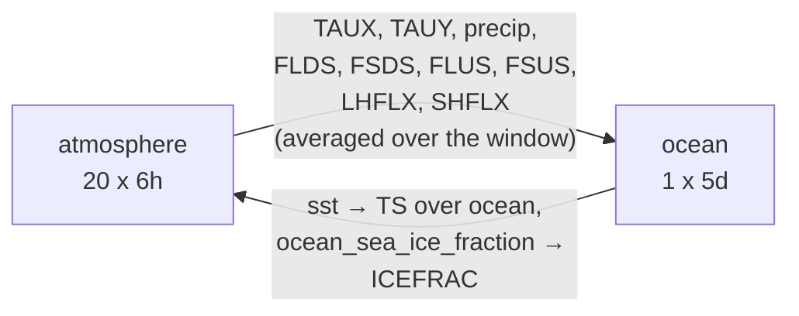

# SamudrACE-E3SMv3 Coupled Inference

This guide walks you through running the fully coupled atmosphere–ocean emulator
[SamudrACE-E3SMv3](https://huggingface.co/allenai/SamudrACE-E3SMv3), a stochastic emulator of an
E3SMv3 preindustrial control simulation. Unlike [ACE2-EAMv3](ace2-inference.md), which is
atmosphere-only and needs prescribed SSTs, this model evolves the ocean and sea ice too, so the
only external forcing is time-invariant (or annually repeating) boundary data.

| | |
|---|---|
| Atmosphere component | `NoiseConditionedSFNO`, 6-hour timestep, 1° (180×360), 8 layers |
| Ocean component | `Samudra`, 5-day timestep, 1° (180×360), 19 depth levels |
| Coupling | one coupled (ocean) step = 20 atmosphere steps |
| Training data | E3SMv3 preindustrial control |
| Reference | [arXiv:2608.10277](https://arxiv.org/abs/2608.10277) |

!!! warning "research tool"
    ACE models are research tools and should not be used for operational climate prediction.

## How the coupling works

Within one coupled step, the atmosphere runs first for the 20 6-hour steps that fit into one 5-day
ocean step, forced by the SST it inherits from the ocean. The ocean then takes a single step,
forced by the atmosphere's fluxes *averaged over those 20 steps*, and hands back a new SST and
sea-ice fraction for the next coupled step.



External forcing is limited to `SOLIN`, `LANDFRAC`, `PHIS` (atmosphere) and the ocean/sea-ice masks
and `sea_surface_fraction` (ocean) — everything else is predicted.

## Prerequisites for this guide

- [uv](https://github.com/astral-sh/uv) installed to set up the environment, including PyTorch.
  See our [Python Environment Setup](python-envs.md) for more details.
- `git-lfs` for downloading the model from Hugging Face.
- A GPU node. Everything below was run on a single NERSC `pm-gpu` node:

    ```console
    salloc --nodes 1 --qos interactive --time 04:00:00 --constraint gpu --account=e3sm_g
    ```

    Only one of the four A100s is used unless you run under `torchrun` (see [below](#running-on-more-than-one-gpu)).

## Steps

### 1. Clone the ACE Repository

```console
git clone https://github.com/E3SM-Project/ace
```

The coupled code lives under `fme/coupled` and is a separate entry point from the atmosphere-only
`fme.ace.inference`. This guide was tested against `main` at commit `e273d5438`.

### 2. Download the Model

The Hugging Face repository is ~4.9 GB, but it ships three checkpoints: a coupled one and the two
standalone components. For coupled inference you only need `SamudrACE-E3SMv3.tar`, so skip the LFS
blobs on clone and pull just what you need:

```console
GIT_LFS_SKIP_SMUDGE=1 git clone https://huggingface.co/allenai/SamudrACE-E3SMv3
cd SamudrACE-E3SMv3
git lfs pull --include="SamudrACE-E3SMv3.tar,forcing_data/*,initial_conditions/*"
```

That gives you:

```console
> du -h --max-depth=1 --exclude=.git .
369M    ./forcing_data       # atmosphere-forcing-1yr.nc, ocean-forcing-1yr.nc
144M    ./initial_conditions # 3 ICs each for atmosphere and ocean
2.6G    .                    # + SamudrACE-E3SMv3.tar (2.1 GB)
```

!!! note "disk usage"
    `git lfs` keeps a second copy of every file it fetches under `.git/lfs/objects`, so the clone
    occupies roughly twice the size of the checked-out files (2.6 GB of files plus 2.6 GB in
    `.git`). Run `git lfs prune` afterwards, or delete `.git` entirely if you do not plan to pull
    more files.

The forcing and initial condition files are worth a look before you configure a run:

| File | Contents |
|---|---|
| `forcing_data/atmosphere-forcing-1yr.nc` | 1460 6-hourly steps (1 year) of `SOLIN`, `LANDFRAC`, `PHIS`, `P0`, and the `ak`/`bk` vertical coordinates |
| `forcing_data/ocean-forcing-1yr.nc` | 73 5-daily steps (1 year) of ocean/sea-ice masks and `sea_surface_fraction` |
| `initial_conditions/SamudrACE-E3SMv3-ICx3-train_atmosphere_ic.nc` | 3 ICs, dated 0425-01-03, 0426-01-03, 0427-01-03 |
| `initial_conditions/SamudrACE-E3SMv3-ICx3-train_ocean_ic.nc` | same 3 dates, ocean and sea-ice prognostics |

Because this is a preindustrial control emulator, the forcing is a single year that is simply
repeated (`n_repeats`) for as long as the run needs.

### 3. Run Inference

From the `ace` repository directory, create `config-inference.yaml`. The configuration below is a
60-day smoke test; adjust the paths to your environment.

``` { .yaml .annotate }
experiment_dir: /pscratch/sd/m/mahf708/SamudrACE-E3SMv3/test1 # (1)!
n_coupled_steps: 12 # (2)!
coupled_steps_in_memory: 4 # (3)!
checkpoint_path: /pscratch/sd/m/mahf708/SamudrACE-E3SMv3/SamudrACE-E3SMv3.tar # (4)!
initial_condition: # (5)!
  ocean:
    path: /pscratch/sd/m/mahf708/SamudrACE-E3SMv3/initial_conditions/SamudrACE-E3SMv3-ICx3-train_ocean_ic.nc
  atmosphere:
    path: /pscratch/sd/m/mahf708/SamudrACE-E3SMv3/initial_conditions/SamudrACE-E3SMv3-ICx3-train_atmosphere_ic.nc
  start_indices:
    first: 0
    n_initial_conditions: 1
forcing_loader: # (6)!
  atmosphere:
    dataset:
      data_path: /pscratch/sd/m/mahf708/SamudrACE-E3SMv3/forcing_data
      file_pattern: atmosphere-forcing-1yr.nc
      n_repeats: 2
  ocean:
    dataset:
      data_path: /pscratch/sd/m/mahf708/SamudrACE-E3SMv3/forcing_data
      file_pattern: ocean-forcing-1yr.nc
      n_repeats: 2
  num_data_workers: 1
logging: # (7)!
  log_to_screen: true
  log_to_wandb: false
  log_to_file: true
data_writer: # (8)!
  ocean:
    save_prediction_files: true
    save_monthly_files: true
  atmosphere:
    save_prediction_files: true
    save_monthly_files: true
```

1. **Output directory** — All inference outputs are written here, in `ocean/` and `atmosphere/`
   subdirectories. It is created for you if it does not exist.
2. **Number of coupled steps** — Counted in *ocean* steps of 5 days each, so 12 steps = 60 days and
   73 steps ≈ 1 year. Each coupled step internally runs 20 atmosphere steps of 6 hours.
3. **Steps in memory** — How many coupled steps are held on the GPU before being flushed to disk.
   `n_coupled_steps` **must be divisible by** `coupled_steps_in_memory`, otherwise the run aborts
   during config validation. Lower it if you hit OOM.
4. **Model checkpoint** — The coupled checkpoint. The standalone
   `SamudrACE-E3SMv3-atmosphere.tar` / `-ocean.tar` files are for running the components on their
   own; they can also be coupled at inference time by replacing this string with a mapping of
   `ocean:` / `atmosphere:` entries, each with a `path` and a `timedelta` (`5D` and `6h` here).
5. **Initial conditions** — Atmosphere and ocean ICs are given separately, but `start_indices`
   refers to the **ocean** file, and the atmosphere file must carry the same timestamps. The
   example uses a single IC to keep the smoke test cheap; set `n_initial_conditions: 3` to run all
   three shipped ICs as an ensemble.
6. **Forcing data** — Separate loaders for atmosphere and ocean, each pointing at a directory plus
   a `file_pattern`. `n_repeats` cycles the one-year file; it must cover the whole run, including
   the offset of the latest initial condition (see the tip below).
7. **Logging options** — `log_to_screen` prints progress; `log_to_wandb` sends metrics to Weights &
   Biases (requires login); `log_to_file` saves `inference_out.log` in the `experiment_dir`.
8. **Output writer** — Configured per component. `save_prediction_files` writes every step and gets
   very large very quickly (see [Results](#4-results)); `save_monthly_files` writes monthly means
   only. Both accept `names: [sst, ssh]` to restrict the variables written.

!!! tip "how long can I run?"
    The forcing must extend past the end of the *latest* initial condition. The ICs are one year
    apart, so a run of `N` years started from all three ICs needs `n_repeats` of at least `N + 2`.
    The config published with the model runs 2920 coupled steps (40 years) from 3 ICs and sets
    `n_repeats: 43` for both components.

Validate the configuration first — it catches path and shape problems in about 40 seconds instead
of failing after the model has loaded:

```console
uv run python -m fme.coupled.validate_config config-inference.yaml --config_type inference
```

Then run:

```console
uv run python -m fme.coupled.inference config-inference.yaml
```

!!! tip "uv cache"
    Sometimes, you will need to set the environment variable `UV_CACHE_DIR`, e.g., on NERSC,
    `export UV_CACHE_DIR="$PSCRATCH/.cache/uv"`

### 4. Results

Outputs are split by component:

```console
> ls /pscratch/sd/m/mahf708/SamudrACE-E3SMv3/test1
atmosphere  config.yaml  inference_out.log  ocean

> ls -1 /pscratch/sd/m/mahf708/SamudrACE-E3SMv3/test1/ocean
annual_diagnostics.nc
autoregressive_predictions.nc
autoregressive_target.nc
initial_condition.nc
mean_diagnostics.nc
monthly_mean_predictions.nc
monthly_mean_target.nc
power_spectrum_diagnostics.nc
restart.nc
time_mean_diagnostics.nc
```

The two `autoregressive_predictions.nc` files carry the raw trajectories, on each component's own
timestep:

```console
> python -c "import xarray as xr; print(xr.open_dataset('ocean/autoregressive_predictions.nc')[['sst']])"
<xarray.Dataset> Size: 3MB
Dimensions:     (sample: 1, time: 12, lat: 180, lon: 360)   # 12 coupled steps, 5-daily
Coordinates:
    init_time   (sample) object 8B ...
  * time        (time) int64 96B 432000000000 864000000000 ... 5184000000000
    valid_time  (sample, time) object 96B ...
  * lat         (lat) float32 720B -89.24 -88.25 -87.25 ... 87.25 88.25 89.24
  * lon         (lon) float32 1kB 0.5 1.5 2.5 3.5 ... 356.5 357.5 358.5 359.5
Dimensions without coordinates: sample
Data variables:
    sst         (sample, time, lat, lon) float32 3MB ...
Attributes:
    source.git_sha:   e273d5438
    ...

> python -c "import xarray as xr; print(xr.open_dataset('atmosphere/autoregressive_predictions.nc')[['TS']])"
<xarray.Dataset> Size: 62MB
Dimensions:     (sample: 1, time: 240, lat: 180, lon: 360)  # 12 x 20 atmosphere steps, 6-hourly
...
```

The `sample` dimension indexes the ensemble (initial conditions), `time` is an offset in
microseconds from the initial condition, and `valid_time` gives the model dates on the `noleap`
calendar. The grid is Gaussian, so latitudes run from -89.24 to 89.24 rather than to the poles.

The ocean file has 80 variables — `sst`, `ssh`, `ocean_sea_ice_fraction`, `iceVolumeTotal`, and
`temperatureCoarsened_*`, `salinityCoarsened_*`, `velocityZonalCoarsened_*`,
`velocityMeridionalCoarsened_*` on 19 depth levels. The atmosphere file has 62, the same set as
[ACE2-EAMv3](ace2-inference.md) plus surface stresses (`TAUX`, `TAUY`) and near-surface fields
(`Tat2m`, `Qat2m`, `Uat10m`, `Vat10m`, `windspeed_at_10m`) that the ocean component consumes.

!!! warning "output volume"
    Per-step output is the dominant cost of a long coupled run. The 60-day, single-IC run above
    produced **4.2 GB**, almost all of it `atmosphere/autoregressive_predictions.nc` (3.9 GB for
    240 steps — 16 MB per 6-hourly step, 21 MB per 5-daily ocean step). At that rate the published
    40-year, 3-member configuration would write about **3 TB**, which is why it sets
    `save_prediction_files: false` for both components. Use `save_monthly_files: true`, or restrict
    `names`, unless you truly need every step.

`autoregressive_target.nc` only contains the forcing variables, since there is no reference
simulation to compare against in an inference run. To score the emulator against a reference
dataset, use `python -m fme.coupled.evaluator` instead. `restart.nc` in each component directory
holds the final prognostic state of the run; using it to continue a run is untested here and is
left as a task below.

### 5. Performance

Measured on one A100 (40 GB) on `pm-gpu`, with the clean `main` checkout described above:

| Run | Wall time | GPU memory |
|---|---|---|
| 12 coupled steps (60 days), 1 IC, `coupled_steps_in_memory: 4` | 1 min 42 s (66 s of it inference) | 9 GB |
| 72 coupled steps (360 days), 3 ICs, `coupled_steps_in_memory: 8` | RUN2_WALL | 35 GB |

Memory scales with `coupled_steps_in_memory` × number of ensemble members, so if you increase the
number of initial conditions, decrease the steps held in memory.

## Notes

### Stochasticity

The atmosphere component is a noise-conditioned SFNO: it injects random noise at every step, so two
runs of the same configuration produce different trajectories. This is intentional — it is what
makes the model an *ensemble* emulator rather than a deterministic one. Beyond the three shipped
initial conditions, you can also generate several members from the same IC with `n_ensemble_per_ic`
in the config.

### Running on more than one GPU

Inference splits ensemble members across ranks, so multi-GPU only helps when you are running
several initial conditions, and the number of members must be divisible by the number of ranks:

```console
uv run torchrun --nproc_per_node=3 -m fme.coupled.inference config-inference.yaml
```

A single process uses one GPU regardless of how many are on the node.

## Remaining tasks

- [ ] Reproduce the full 40-year piControl run from the published configuration
- [ ] Document the restart workflow using `restart.nc`
- [ ] Compare emulated variability against the E3SMv3 piControl reference simulation
